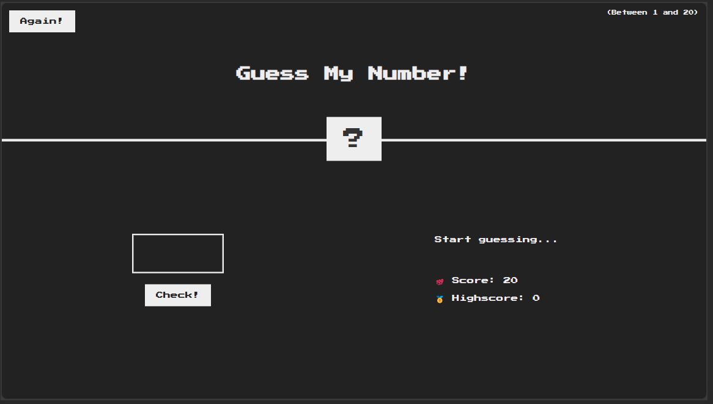

# Guess My Number!

This was the first interactive project in the online Udemy course 'The Complete Javascript Course: 2024'. The goal of this was to write code to allow the user to interact with the game. There is an input box where the user can type a number. By clicking the 'check!' button it will check to see if the number entered is larger, smaller, or equal to the randomly generated number (1 - 20). If it is too high, the screen will display a message saying the number is too high. If it is too low, the screen will display a message saying the number is too low. If you guess the number, it will change to a win screen and check to see if your score is higher than the High Score and if it is, it will set the new high score. You start with 20 points, and each guess costs you one point. When you reach 0 score, you lose.

### Default Screen

### Too High!

### Too Low!

### Winner!

