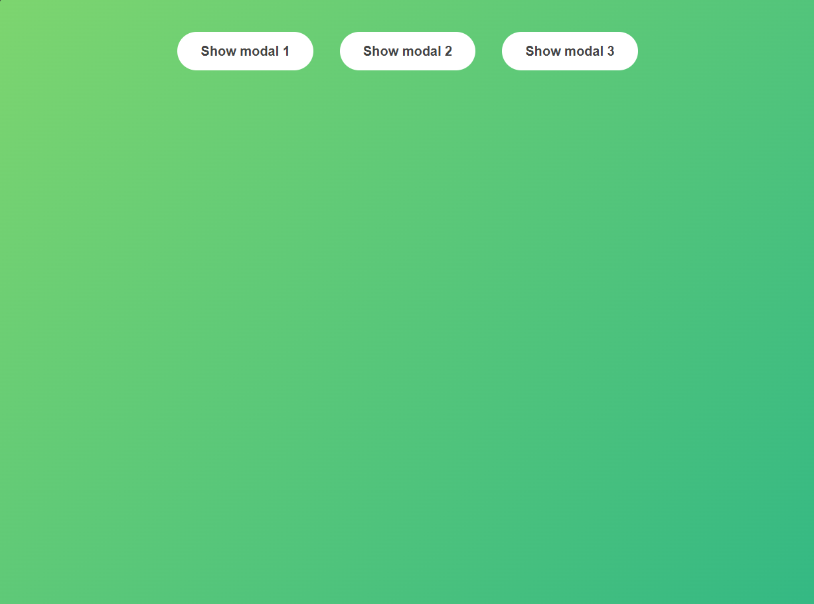
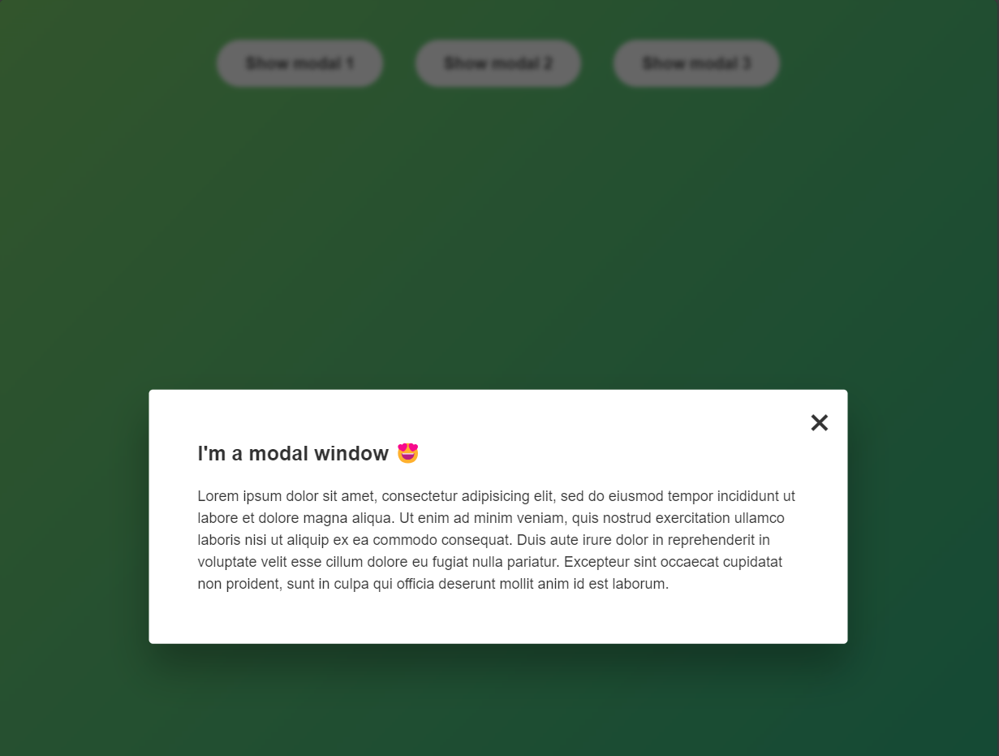

# Create Modal

The point of this exercise was to manipulate the DOM with the click of a button. In this case, when the user clicks buttons it will alter the classes of an element on the webpage which will display or hide the modal element.

### Default

### Modal Open

