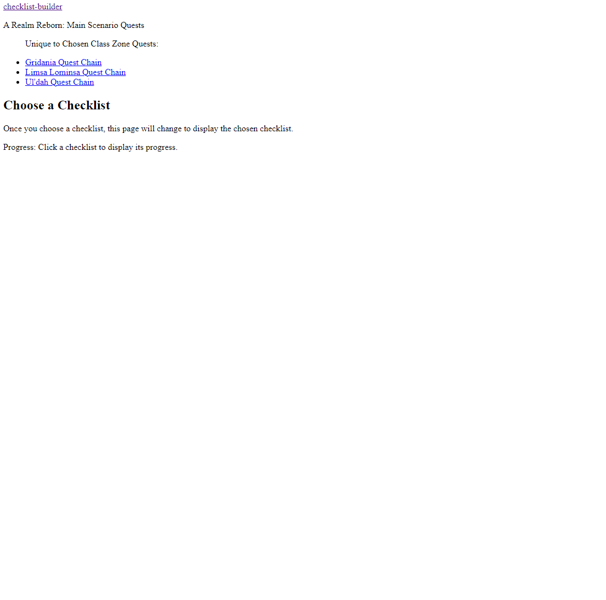
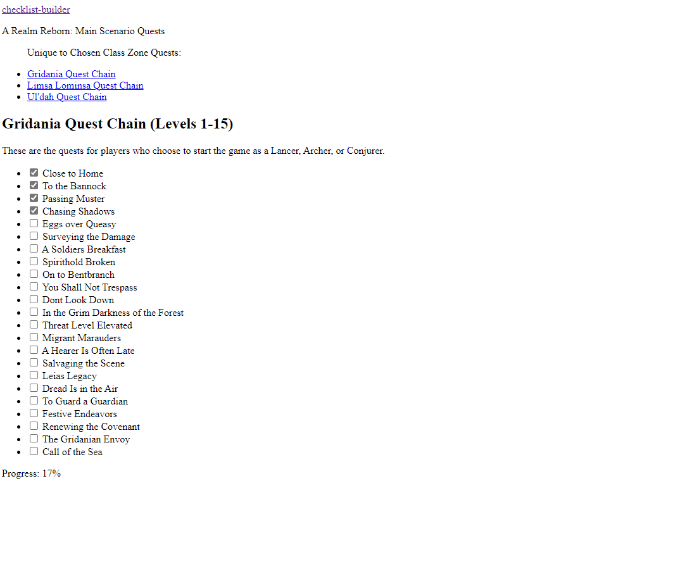
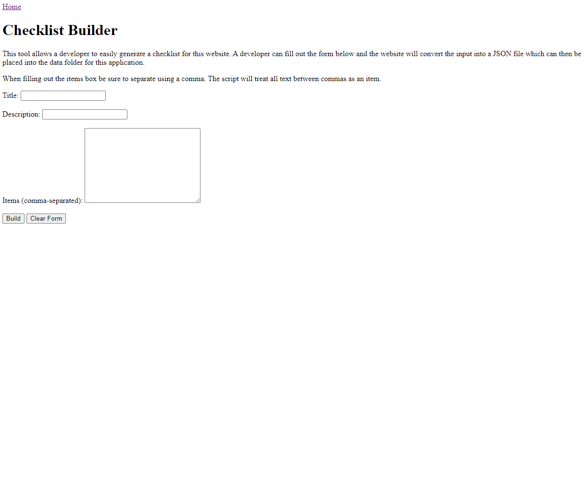
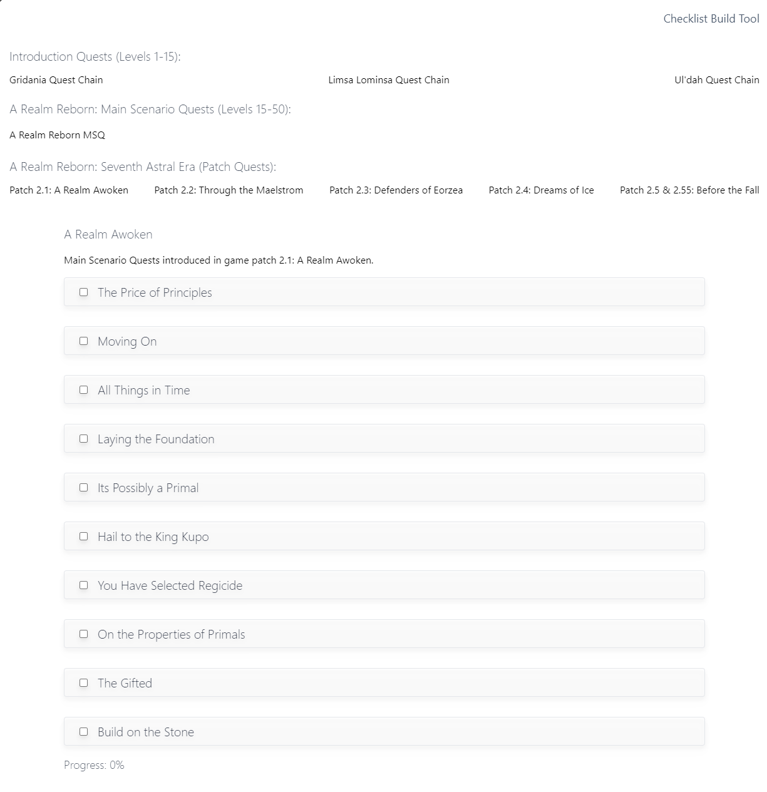
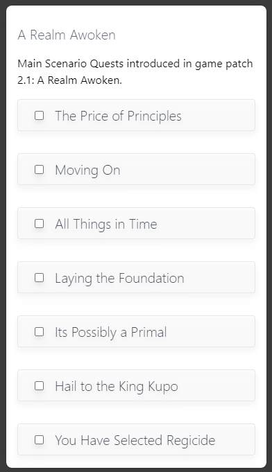

# FFXIV Main Scenario Quest Progress

This web application was built using minimal technology and serves as a means of creating a dynamic web application thats purpose is to help a player track their progress through the Main Scenario Quest line in Final Fantasy 14.

The application is still under development.

## Initial Development

The initial development of this web application contains three checklists. When you click a checklist the web application will then render the data from a JSON file. As you check an item off, it will save in local storage, so if you reset your browser your progress will not save.

I also built a tool to help me create checklists easier. Simply fill out the title of the checklist, the description of the checklist, and begin typing checklist items (being sure to separte them with commas). When the user clicks the build button it will then parse the data into a json file. This tool is specific to this web application.

## Version 1

In version 1 I decided to add Tailwindcss to start styling the application. Currently I am only doing a light theme.

Mobile:

